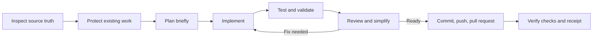
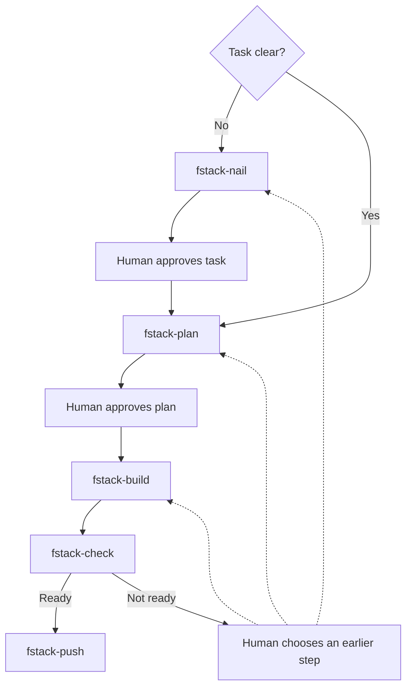

# fstack — the simple stack

Agent skills that ask: can this be less?

## The problem

Skill collections keep growing. Personas, pipelines, ceremonies, and overlapping commands become harder to remember than the work itself.

That complexity leaks into the code. A process built to sound smart often produces layers, abstractions, and options nobody asked for.

## The idea

fstack is 14 small skills with plain names and one job each.

It has two deliberate modes:

- **Interactive mode:** you drive each stage and approve real choices.
- **Cloud mode:** `/fstack-run` continues from source-truth inspection through implementation, tests, review, fixes, commit, push, and pull request.

One skill — `/fstack-simplify` — exists only to remove things.

## Install

With GitHub CLI 2.90 or later, preview and install the continuous runner for GitHub Copilot or another supported agent host:

```sh
gh skill preview naytewilson/fstack fstack-run
gh skill install naytewilson/fstack fstack-run
```

With the cross-agent `skills` CLI, review the collection and install only the runner globally:

```sh
npx skills@latest add naytewilson/fstack --list
npx skills@latest add naytewilson/fstack --skill fstack-run -g -y
```

Install the complete collection interactively:

```sh
npx skills@latest add naytewilson/fstack
```

The skills themselves have no runtime dependencies or build step.

See [Cloud-agent setup](docs/CLOUD_AGENTS.md) for agent-specific installation, permissions, invocation prompts, safety defaults, validation, updates, and maintenance.

## Cloud mode

Use `/fstack-run` when the agent should finish a repository task without routine approval stops.



The runner stops only for a proven external blocker, a decision that changes the safe action, an explicit user stop, or a completed verified delivery.

## Interactive mode

Use the original loop when you want to control each transition:



Invoke a skill directly, or ask `/fstack` to choose one.

## The 14 skills

| Skill | What it does |
|---|---|
| `/fstack` | Front door. Lists the stack or routes a task to one skill. |
| `/fstack-run` | Completes repository work continuously from inspection through verified pull request. |
| `/fstack-roast` | Stress-tests a product idea and finds the smallest version worth building. |
| `/fstack-interview` | Records product, customer, demand, pricing, distribution, and risk context in the repository. |
| `/fstack-counselors` | Gets three independent model opinions and synthesizes one verdict. |
| `/fstack-nail` | Clarifies a vague task and gets approval on a three-line summary. |
| `/fstack-plan` | Writes a one-page plan with a mandatory "what we're NOT doing" section. |
| `/fstack-build` | Implements an approved plan in small verified steps. |
| `/fstack-simplify` | Audits unnecessary complexity and proposes deletions only. |
| `/fstack-design` | Makes UI follow the project's existing visual system. |
| `/fstack-document` | Writes or updates project documentation from ELI5 to deep. |
| `/fstack-check` | Reviews whether work functions, matches the plan, and stays simple. |
| `/fstack-learn` | Captures one non-obvious lesson in three lines. |
| `/fstack-push` | Commits task-owned changes and pushes them. It intentionally does not test or deploy. |

## Repository support for cloud agents

This fork includes:

- `AGENTS.md` — canonical repository-wide agent contract;
- `CLAUDE.md` — Claude Code entrypoint;
- `.github/copilot-instructions.md` — GitHub Copilot coding-agent entrypoint;
- `.github/workflows/validate.yml` — automatic skill validation;
- `.github/pull_request_template.md` — evidence-focused delivery checklist;
- `.cursor/environment.json` — Cursor cloud install hook that runs on each environment boot;
- `.cursor/skills/` — Cursor project skill discovery via symlinks to `skills/`;
- `scripts/install-cursor-cloud-skills.sh` — copies skills into `~/.cursor/skills` for cloud session persistence;
- `scripts/validate.sh` — dependency-free frontmatter, naming, size, duplication, and README checks;
- `scripts/test-validate.sh` — regression tests for validator behavior and path safety;
- `docs/CLOUD_AGENTS.md` — complete operator guide.

Validate locally with:

```sh
sh -n scripts/validate.sh
sh -n scripts/test-validate.sh
sh -n scripts/install-cursor-cloud-skills.sh
sh scripts/test-validate.sh
sh scripts/validate.sh
git diff --check
```

With GitHub CLI 2.90 or later, run the current Agent Skills publishing checks without publishing:

```sh
gh skill publish --dry-run
```

## Philosophy

1. Short sentences. One idea per sentence.
2. Short paragraphs, then a blank line.
3. Plain language before jargon.
4. No personas. Skills describe actions, not characters.
5. One job per skill.
6. Prefer deletion and the smallest complete change.
7. Keep each skill compact; move real detail into referenced files only when needed.
8. Interactive skills stop at decision points. The cloud runner continues through ordinary choices.
9. Stay agent-agnostic and use the open `SKILL.md` format.
10. Evidence beats confidence. Unrun tests are missing evidence, not a pass.
11. Preserve unrelated work. Never make destructive Git behavior an automation default.
12. A cloud run is done only after implementation, verification, review, and durable delivery.

## Credits

fstack exists because of the stacks it distills. [gstack](https://github.com/garrytan/gstack) by Garry Tan gave it the full lifecycle idea and idea-roasting step. [pstack](https://cursor.com/marketplace/cursor/pstack) by Lauren Tan gave it design-before-code and blast-radius thinking. [Compound Engineering](https://github.com/EveryInc/compound-engineering-plugin) by Every gave it the plan artifact and lesson-capture step. [Matt Pocock's skills](https://github.com/mattpocock/skills) gave it grilling, two-axis review, and the small-skills shape. [counselors](https://github.com/aarondfrancis/fstack-counselors) by Aaron Francis gave it the independent-advisor pattern behind `/fstack-counselors`.

The original fstack was created by [Flavio Copes](https://github.com/flaviocopes/fstack). This fork keeps the interactive stack and adds the continuous cloud-agent operating mode.

## License

MIT
